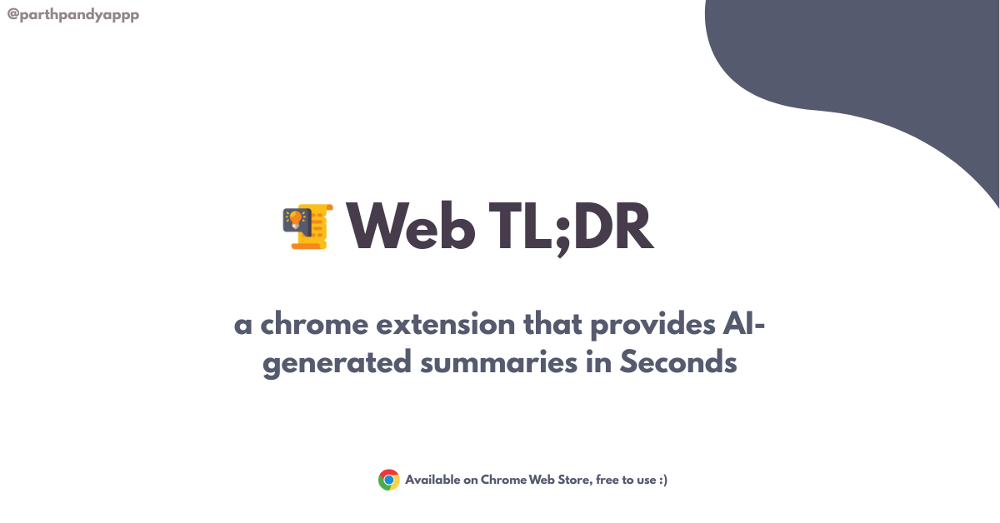

# 🚀 Welb TLDR – Chrome Extension for AI Summaries

**Welb TLDR** is a lightweight Chrome extension that uses AI to generate concise summaries of web articles, blog posts, and long-form content – all inside a convenient side panel.



---

## ✨ Features

- 🧠 AI-powered summaries of any webpage
- ⚡ Opens in a Chrome **side panel** for multitasking
- 🕒 Saves time while browsing, researching, or reading
- 🔒 No signups or accounts needed – simple and fast

---

## 🛠️ Built With

- [React](https://reactjs.org/)
- [Vite](https://vitejs.dev/) for blazing fast builds
- [Gemini AI](https://gemini.google.com/app) API for natural language summaries
- Chrome Extensions APIs – using **Manifest v3**

---

## 📦 Installation (Dev Mode)

1. Clone this repository:

   ```bash
   git clone https://github.com/parthpandyappp/websnap-ai.git
   cd websnap-ai
   ```

2. Install dependencies:

   ```bash
   npm install
   ```

3. Run the dev build:

   ```bash
   npm run build
   ```

4. Load it into Chrome:

- Go to chrome://extensions/
- Enable Developer Mode
- Click Load unpacked
- Select the dist/ folder

## 📥 Install from Chrome Web Store

You can directly install the extension from the Chrome Web Store:

👉 [**Welb TLDR - Chrome Extension**](https://chromewebstore.google.com/detail/websnap-ai/ihgpnbdhnbeeacmemamopdkjppjoganj)

Once installed:

1. Pin the extension to your toolbar (optional but handy!)
2. Click the extension icon or use the Chrome **side panel**
3. Start summarizing articles instantly 🚀

## 💡 Ideas for Future

- Save history of summaries
- Multilingual summarization support
- Voice summary or text-to-speech integration
- Export/share summaries to Notion, Docs, etc.
- Smart summarization preferences (e.g. tone, length)

## 📬 Feedback & Contributions

Found a bug? Got a cool feature idea?  
Feel free to [open an issue](https://github.com/yourusername/welb-tldr-extension/issues) or submit a pull request!

We welcome all contributions and suggestions 🤝

## 📄 License

This project is licensed under the [MIT License](./LICENSE).

###### Made with ❤️ by [Parth](https://www.linkedin.com/in/parthpandyappp/)
